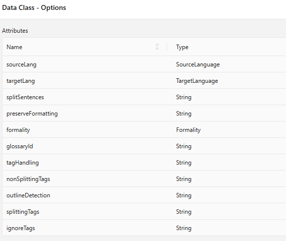

Say goodbye to language barriers in process automation with Axon Ivy's translation service powered by DeepL. The connector seamlessly integrates into your existing workflows, allowing you to communicate easily regardless of the language.

### Key features

This marketplace item:

- Is based on the future-proof OpenAPI specification.
- Translates entire Word (.docx), PowerPoint (.pptx), PDF (.pdf), text (.txt), and HTML (.html) files.
- Gives you the power of all DeepL API features.
- Supports you with a demo implementation to reduce your integration effort.
- Enables low-code citizen developers to provide multi-lingual user interfaces.
- Low-code callable subroutines (`text` and `document`) for quick process integration.
- Built-in REST client authentication feature to inject the DeepL API key from `config/variables.yaml`.
- Comprehensive language helper with a curated list of supported source and target languages.

## Demo

The document translation demo shows how easy it has become, to translate documents throughout your workflow, into the language of your end user.


Of course pure text translations are demonstrated too.
This is very handy to translate user input which was written in a foreign language.


To use DeepL powered translations, we have created a minimal simplistic interface without technical difficulties.
Get inspired and use DeepL anywhere in your workflow.


We have also introduced new Options to fully utilize the client parameters. 
Here, we show two newly introduced options for source_language and tag_handling, but you can access all options using this new `deepl.translate.Options` object.




### Demo workflows

- Document translation (demo):
	1. Open the `translateFile` demo dialog.
 2. Upload a file (e.g., .docx, .pdf, .pptx).
 3. Choose the target language and optional `deepl.translate.Options` (formality, glossary, tag handling).
 4. Start translation and download the translated file when ready.

- Text translation (demo):
	1. Open the `translateText` demo dialog.
 2. Paste or enter the text to be translated.
 3. Select the target language and advanced options if needed.
 4. Trigger translation and copy or use the returned text in your workflow.

## Setup

Get a [free developer account](https://www.deepl.com/pro#developer) from DeepL.com
Copy the API-Key of your account into

`config/variables.yaml` under
`variables.com.axonivy.connector.deepl.authKey`

```
@variables.yaml@
```

## Components

- Maven artifacts included with this product:

	1. com.axonivy.connector.deepl:deepl-connector-demo:${version} (demo IAR)
		 ```xml
		 <dependency>
			 <groupId>com.axonivy.connector.deepl</groupId>
			 <artifactId>deepl-connector-demo</artifactId>
			 <version>${version}</version>
			 <type>iar</type>
		 </dependency>
		 ```

	2. com.axonivy.connector.deepl:deepl-connector:${version} (connector IAR used as runtime dependency)
		 ```xml
		 <dependency>
			 <groupId>com.axonivy.connector.deepl</groupId>
			 <artifactId>deepl-connector</artifactId>
			 <version>${version}</version>
			 <type>iar</type>
		 </dependency>
		 ```

	- OpenAPI specification used by the connector:

		https://raw.githubusercontent.com/DeepLcom/openapi/main/openapi.yaml

### Callables

The main module exposes low-code callable subroutines for direct use in processes:

- `text(String, TargetLanguage)` — translate a short text to a target language.
- `document(File, TargetLanguage)` — translate a document file and return a translated file.
- `text(String, Options)` — translate text with full `deepl.translate.Options`.
- `document(File, Options)` — translate a document with full `deepl.translate.Options`.
