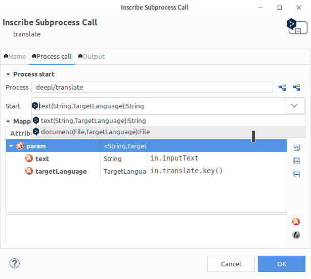
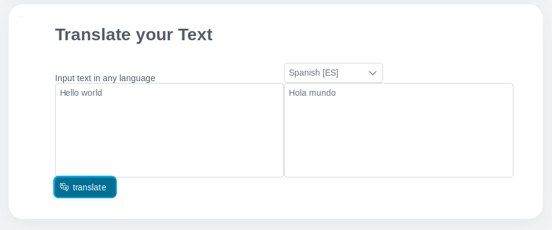
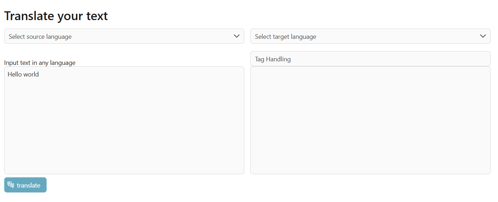
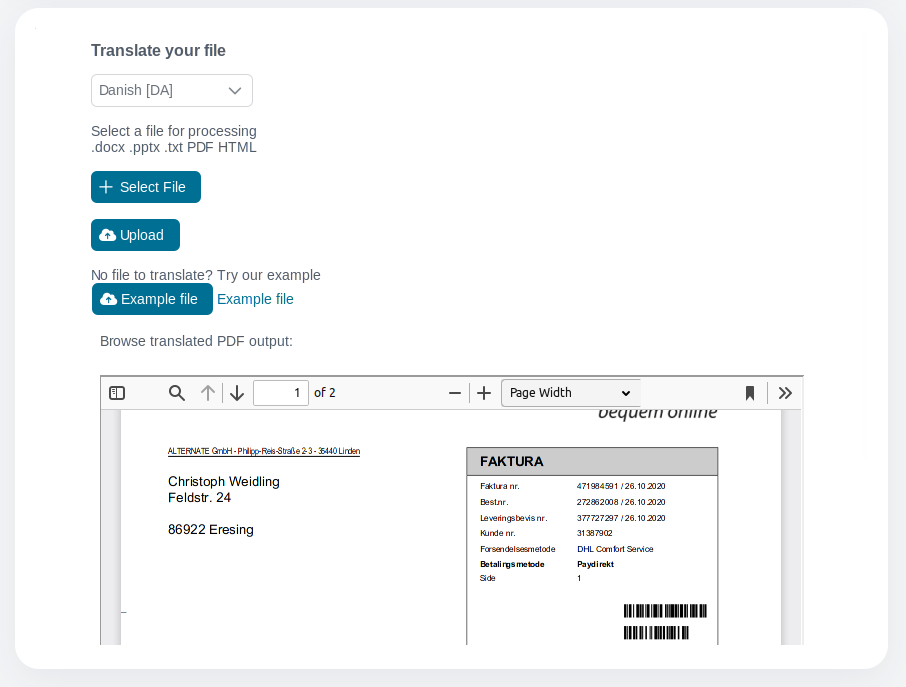
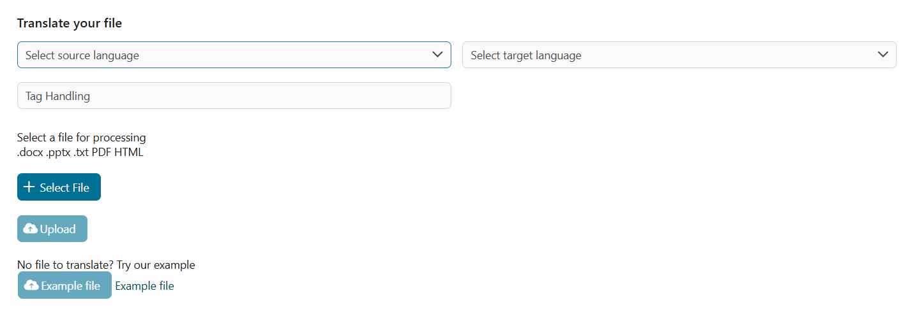

# DeepL Connector

The DeepL Connector integrates [DeepL's](https://www.deepl.com) world-class machine translation API into your Axon Ivy processes. Translate plain text and entire documents directly from your workflows, with fine-grained control over formality, glossary usage, and language detection — all powered by the official DeepL REST API.



**Key features**

- Translate text into any supported language directly from your Axon Ivy processes
- Upload and translate full documents (DOCX, PDF, PPTX, HTML, TXT) while preserving original formatting
- Control translation behavior with advanced options: formality, glossary IDs, sentence splitting, and tag handling
- Automatically detect the source language or choose explicitly from all supported DeepL source languages
- Use simple target-language shortcuts or the full `Options` object for advanced translation scenarios
- Leverage the official DeepL OpenAPI specification for type-safe, connector-level REST calls

## Demo

The DeepL Connector provides two interactive demo processes so you can explore text and document translation straight from the Axon Ivy Designer. No DeepL account is required when running against the built-in mock server.

### Demo Workflows

##### Translate Text

1. Launch the **Translate Text** process from the Axon Ivy demo menu.
2. You'll see a form with source and target language selectors and a text input area pre-filled with a sample HTML snippet.
3. Select your desired target language and enter or modify the text to translate.
4. Submit the form to trigger the translation and review the result displayed in the output field.





##### Translate File

1. Launch the **Translate File** process from the Axon Ivy demo menu.
2. You'll see a file upload form with source and target language dropdowns.
3. Upload a document in any supported format (DOCX, PPTX, TXT, PDF, or HTML), or click **Example file** to use the built-in sample invoice.
4. Click **Upload** to send the file to DeepL for translation, then download the translated document when processing is complete.





## Setup

- **Roles:** Everybody
- **OpenAPI:** https://raw.githubusercontent.com/DeepLcom/openapi/main/openapi.yaml

1. Obtain a DeepL API authentication key from the [DeepL API documentation](https://www.deepl.com/docs-api/api-access/authentication/). Free-tier keys end with `:fx`.
2. Open your Axon Ivy application configuration and navigate to the **Variables** section.
3. Set the variable `com.axonivy.connector.deepl.authKey` to your DeepL API authentication key.

### Variables

```
@variables.yaml@
```

## Components

### Callable Subprocesses

#### translate.p.json

- **Signature**: text(String text, com.deepl.api.v2.client.TargetLanguage targetLanguage) -> translation: String
    - Input:
        - `text` (String) - The text to translate
        - `targetLanguage` (com.deepl.api.v2.client.TargetLanguage) - The wished target language
    - Result:
        - `translation` (String)

- **Signature**: text(String text, deepl.translate.Options options) -> translation: String
    - Input:
        - `text` (String) - The text to translate
        - `options` (deepl.translate.Options) - Full options for rest client
    - Result:
        - `translation` (String)

- **Signature**: document(File file, com.deepl.api.v2.client.TargetLanguage targetLanguage) -> translated: File
    - Input:
        - `file` (File) - A file to translate (e.g. docx, pdf, pptx)
        - `targetLanguage` (com.deepl.api.v2.client.TargetLanguage) - The language to translate to
    - Result:
        - `translated` (File)

- **Signature**: document(File file, deepl.translate.Options options) -> translated: File
    - Input:
        - `file` (File) - A file to translate (e.g. docx, pdf, pptx)
        - `options` (deepl.translate.Options) - Full options for rest client
    - Result:
        - `translated` (File)

### Dialog Components

- For this market extension we do not provide any dialog components.

### Web Services

- For this market extension we do not provide any web services.

### Maven Artifacts

1. deepl-connector

```xml
<dependency>
  <groupId>com.axonivy.connector.deepl</groupId>
  <artifactId>deepl-connector</artifactId>
  <type>iar</type>
</dependency>
```

2. deepl-connector-demo *(optional)*

```xml
<dependency>
  <groupId>com.axonivy.connector.deepl</groupId>
  <artifactId>deepl-connector-demo</artifactId>
  <type>iar</type>
</dependency>
```
