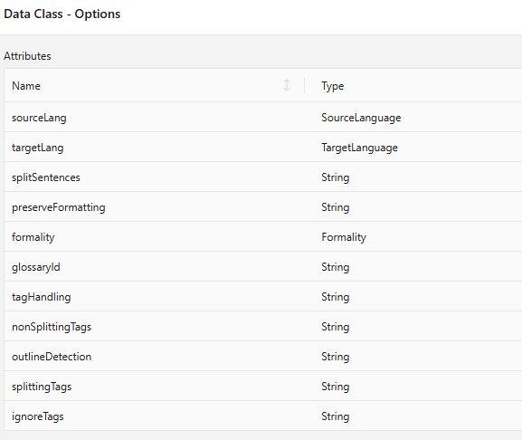

Say goodbye to language barriers in process automation with Axon Ivy's translation service powered by DeepL. The connector seamlessly integrates into your existing workflows, allowing you to communicate easily regardless of the language. This marketplace item:

- Is based on the future-proof OpenAPI specification.
- Translates entire Word (.docx), PowerPoint (.pptx), PDF (.pdf), text (.txt), and HTML (.html) files.
- Gives you the power of all DeepL API features.
- Supports you with a demo implementation to reduce your integration effort.
- Enables low-code citizen developers to provide multi-lingual user interfaces.

## Demo

The document translation demo shows how easy it has become, to translate documents throughout your workflow, into the language of your end user.


Of course pure text translations are demonstrated too.
This is very handy to translate user input which was written in a foreign language.


To use DeepL powered translations, we have created a minimal simplistic interface without technical difficulties.
Get inspired and use DeepL anywhere in your workflow.


We have also introduced new Options to fully utilize the client parameters. 
Here, we show two newly introduced options for source_language and tag_handling, but you can access all options using this new `deepl.translate.Options` object.




## Setup

Get a [free developer account](https://www.deepl.com/pro#developer) from DeepL.com
Copy the API-Key of your account into

`config/variables.yaml` under
`variables.deepl-connector.authKey`

```
@variables.yaml@
```