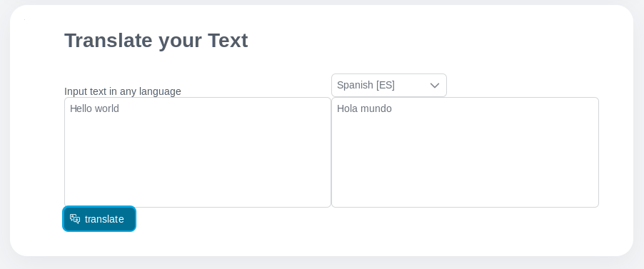

Sag #Lebwohl zu Sprache Hemmnisse in Arbeitsgang Automatisierung mit #Axon Efeus
Übersetzung Bedienung #ausrüsten mal DeepL. Der Anschluss integriert #bruchlos
hinein eure #existierend workflows, erlaubend dir zu kommunizieren sicher #ohne
Rücksicht auf von der Sprache. Dieses Marktplatz Stück:

- Ist gegründet auf das künftiges-Beweis OpenAPI Beschreibung.
- Übersetzt ganzes Wort (.docx), PowerPoint (.pptx), #PDF (.pdf), Text (.txt),
  Und #HTML (.html) Dateien.
- Gibt du die Kraft von alle DeepL API Charakterzüge.
- Unterstützt du mit eine Demo Ausführung zu heruntersetzen eure Integration
  Anstrengung.
- Aktiviert nieder-Code Bürger Entwickler zu versehen mehrsprachige Nutzer
  Schnittstellen.

## Demo

Die Dokument Übersetzung Demo Vorstellungen wie leicht ihm hat geworden, zu
übersetzen durchweg Dokumente eure workflow, hinein die Sprache von euren Ende
Nutzer.


Natürlich purer Text Übersetzungen sind demonstriert auch. Dies ist sehr
praktisch zu übersetzen Nutzer #einlesen #welche war geschrieben in einer
Fremdsprache.



Zu benutzen DeepL #ausrüsten Übersetzungen, wir haben eine minimale
#holzschnittartig Schnittstelle geschafft ohne technisch Schwierigkeiten.
Bekommen inspiriert und benutzen DeepL irgendwo herein eure workflow.


Wir haben auch neue Optionen hereingebracht zu vollauf nutzen die Kunden
Parameter. Hier, wir zeigen zwei neulich brachten herein Optionen für
Quelle_Sprache und Anhängsel_Handing, aber du können alle Optionen zugreifen
benutzend dieses neues `deepl.Übersetz.Optionen` Objekt.


## Einrichtung

Bekomm ein [freies Entwickler Konto](https://www.deepl.com/pro#developer) von
DeepL.com Kopie die API-Schlüssel von eurem Konto hinein

`config/Variablen.yaml` Unter `Variablen.deepl-Anschluss.authKey`

```
@variables.yaml@
```
