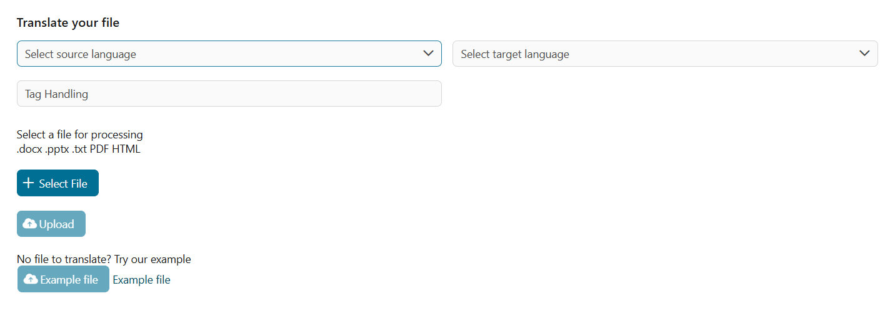

Verabschieden Sie sich von Sprachbarrieren in der Prozessautomatisierung mit dem
Übersetzungsservice von Axon Ivy, der auf DeepL basiert. Der Konnektor lässt
sich nahtlos in Ihre bestehenden Workflows integrieren und ermöglicht Ihnen eine
einfache Kommunikation unabhängig von der Sprache. Dieser Marktplatzartikel:

- Basiert auf der zukunftssicheren OpenAPI-Spezifikation.
- Übersetzt ganze Word- (.docx), PowerPoint- (.pptx), PDF- (.pdf), Text- (.txt)
  und HTML- (.html) Dateien.
- Damit stehen Ihnen alle Funktionen der DeepL-API zur Verfügung.
- Bietet eine Demo Implementierung.
- Ermöglicht Low-Code-Citizen-Developern die Bereitstellung mehrsprachiger
  Benutzeroberflächen.

## Demo

Die Dokumentübersetzungs-Demo zeigt, wie einfach es geworden ist, Dokumente
während Ihres gesamten Workflows in die Sprache Ihres Endnutzers zu übersetzen.


Natürlich werden auch reine Textübersetzungen gezeigt. Dies ist sehr praktisch,
um Benutzereingaben zu übersetzen, die in einer Fremdsprache verfasst wurden.


Um DeepL-basierte Übersetzungen nutzen zu können, haben wir eine
minimalistische, einfache Benutzeroberfläche ohne technische Schwierigkeiten
entwickelt. Lassen Sie sich inspirieren und nutzen Sie DeepL überall in Ihrem
Arbeitsablauf.


Wir haben außerdem neue Optionen eingeführt, um die Client-Parameter voll
auszuschöpfen. Hier zeigen wir zwei neu eingeführte Optionen für source_language
und tag_handling, aber Sie können auf alle Optionen zugreifen, indem Sie dieses
neue `deepl.translate.Options` Objekt verwenden.




## Setup

Erstellen Sie ein [kostenloses
Entwicklerkonto](https://www.deepl.com/pro#developer) bei DeepL.com Kopieren Sie
den API-Schlüssel Ihres Kontos in

`config/variables.yaml` unter `variables.deepl-connector.authKey`

```
@variables.yaml@
```
